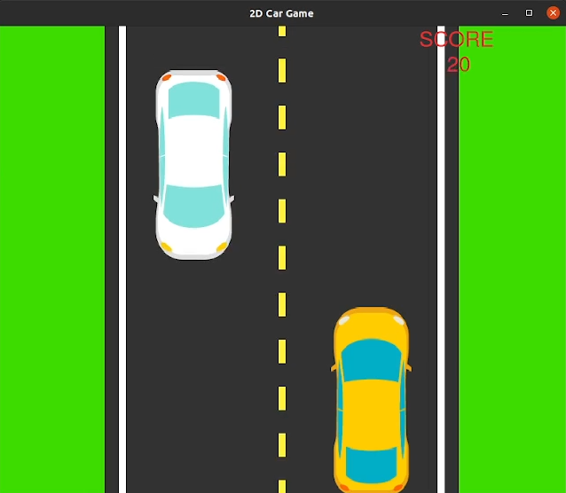
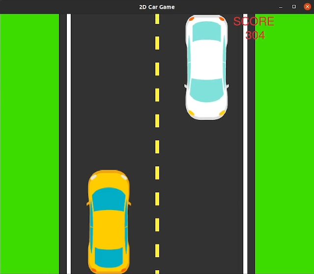

# Pygame: Auto de Carrera

Bienvenido al proyecto Pygame Auto de Carrera, un esfuerzo colaborativo para mejorar un divertido y atractivo juego de Auto de Carrera construido utilizando la biblioteca Pygame. Este proyecto está abierto a cualquier persona que quiera contribuir a mejorar el juego.


## Cómo Jugar

Corre tan lejos como puedas mientras evitas los vehículos que vienen en sentido contrario. Cuanto más lejos conduzcas, más puntos obtendrás.  
```
Cambiar a Carril Izquierdo:    A, o Flecha Izquierda 
Cambiar a Carril Derecho:      D, o Flecha Derecha 
Acelerar:                     W, o Flecha Arriba 
Pausar:                       Barra Espaciadora
Salir:                        Q, o ESC
```

## Capturas de Pantalla
<p align="middle">

&nbsp; &nbsp; &nbsp; &nbsp;

</p>

---